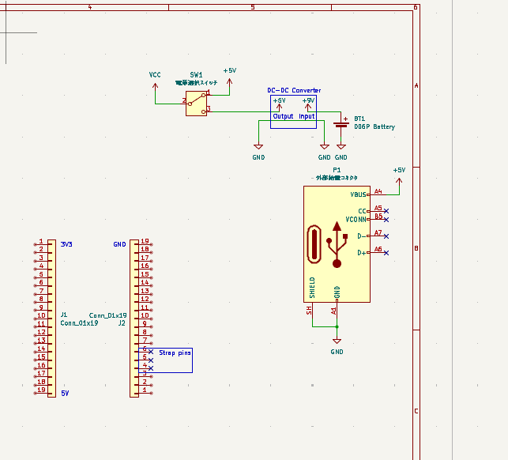
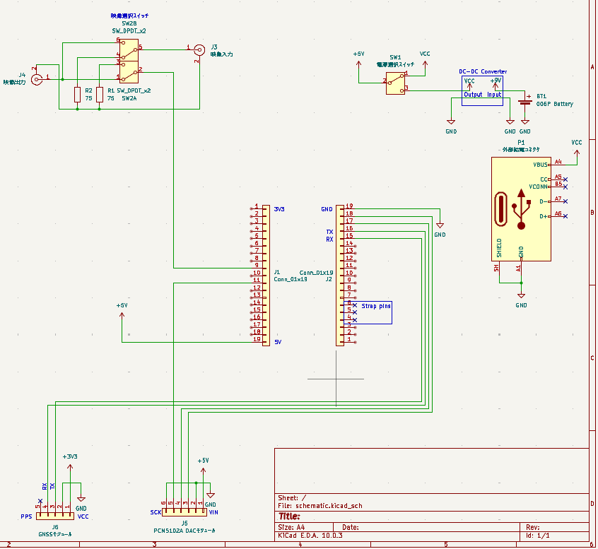
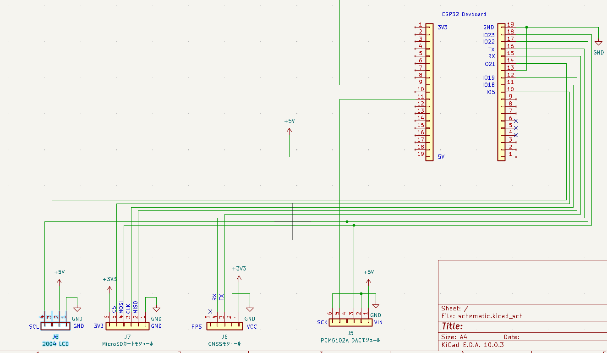
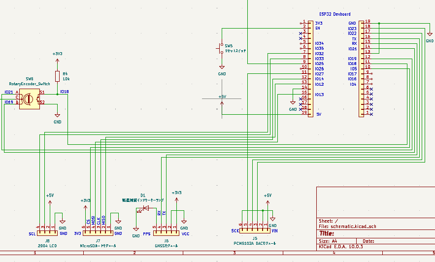
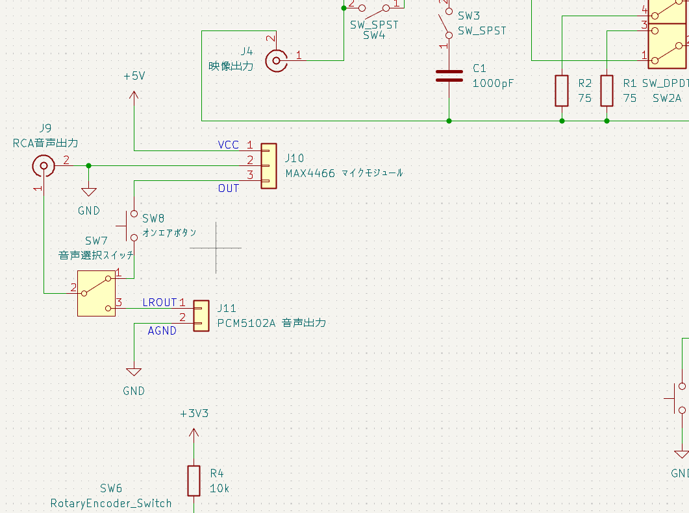
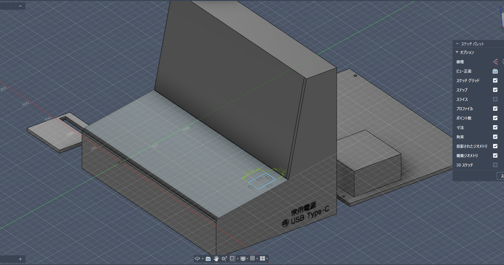

# 6/7: Created the 3D data for the enclosure.
I made a case today!  
I think it turned out pretty well.  
However, if I try to print it as is, I’ll probably have to use a lot of support material, so I’m going to split it up.  

  
**Total time spent: 3 hours**

# 6/8: Created schematics.
I drew a circuit diagram today!  
I thought I wouldn't be able to get much done since it's exam season, but I managed to work on it for two whole hours.  
I'm worried I won't be able to wake up tomorrow...  

  
**Total time spent: 2 hours**

# 6/9: Added audio DAC and video output and GNSS module to schematic.
Today, I added a few things to the circuit diagram.  
I made it possible to select video sources, so you can choose sources other than this device’s output.  
I think this will allow you to overlay videos recorded with a camera or similar device, so I figured it would be a good idea.  

  
**Total time spent: 3 hours**

# 6/10: Added LCD and TF card slot and so on.
Today, I added a micro SD card slot and an LCD to the circuit diagram.  
For one reason or another, I have to keep comparing the pin layout with the product page, which is quite a hassle.  

  
**Total time spent: 2 hours**

# 6/11: Added rotary encoder and so other components.
Today I added a rotary encoder and a few other things.  
I’m in a bit of a bind because I haven’t been able to find any time to study for my midterms.  

  
**Total time spent: 1.5 hours**

# 6/13: Added a microphone and audio output.
Today I added a microphone and audio output.  
It ended up taking longer than I expected.  
I haven't made any progress studying for my midterms—I just can't do it anymore.  

  
**Total time spent: 3 hours**

# 6/29: Created lid and added LED lamps, Push button.
Today I added a lid, an LED light, and some push buttons.
It all seemed so overwhelming that I didn't know where to start, so it ended up taking me quite a while.

**Total time spent: 1 hours 36 minutes**